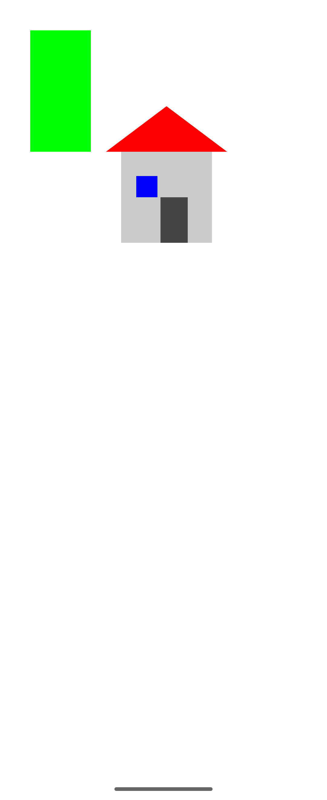

# Лабораторная работа №1 — Знакомство с Android Studio

**Дисциплина:** Разработка мобильных приложений  
**Студент:** Арустамов Артур Амиранович 
**Группа:** ИНС-б-о-24-2  
**Дата рождения:** 31.07.2006  
**СКФУ, 2026**

---

## Цель работы

Изучение интерфейса Android Studio и создание простого Android-приложения с использованием графических примитивов Canvas.

---

## Вариант

| Задание | Вариант | Описание |
|----------|----------|-----------|
| Задание 3 | 1 | Зелёный прямоугольник, у которого высота в 2 раза больше ширины |
| Задание 4 | 1 | Дом с дверью и окном |

---

## Ход выполнения работы

### 1. Создание проекта

В среде Android Studio создан проект типа **Empty Views Activity** на языке Java.  
Название лабораторной работы указано в заголовке приложения с помощью метода `setTitle()`.

### 2. Реализация графики

Для отрисовки фигур создан пользовательский класс `DrawView`, наследующийся от класса `View`.

В классе переопределён метод `onDraw(Canvas canvas)`, в котором выполняется рисование фигур с использованием объектов `Canvas` и `Paint`.

---

## Задание 3 — Зелёный прямоугольник

Нарисован зелёный прямоугольник.  
Ширина задаётся фиксированным значением, высота вычисляется по формуле:

height = 2 × width

Для построения используется метод `drawRect()`.

---

## Задание 4 — Дом с дверью и окном

Дом построен из графических примитивов:

- Основание — `drawRect()`
- Крыша — `Path`
- Дверь — `drawRect()`
- Окно — `drawRect()`

Использовано более трёх цветов.

---

## Использованные элементы

- `Canvas` — холст для рисования
- `Paint` — объект, задающий цвет и стиль
- `Path` — построение сложных фигур
- Переопределение метода `onDraw()`

---

## Ответы на контрольные вопросы

**1. Понятие виджета**  
Виджет — это элемент пользовательского интерфейса Android, наследующийся от класса `View`.

**2. Графические примитивы**  
Графические примитивы — это базовые фигуры (прямоугольник, круг, линия), которые рисуются на объекте `Canvas` с помощью `Paint`.

**3. Переопределение метода**  
Переопределение — изменение реализации метода родительского класса в дочернем классе. В работе переопределён метод `onDraw()`.

**4. Наследование**  
Наследование — механизм ООП, при котором один класс получает свойства и методы другого. Класс `DrawView` наследуется от `View`.

---

## Скриншот результата

---

## Вывод

В ходе лабораторной работы изучен интерфейс Android Studio, создан пользовательский класс для рисования и реализованы задания с использованием графических примитивов.
